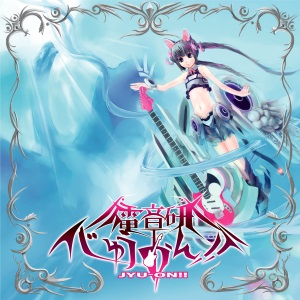

# じゅうおん！！

Heavy metal arrangement songs from [K-On!](https://en.wikipedia.org/wiki/K-On!). じゅうおん (重音) means heavy tone like a heavy metal \m/

by バナ

## Tracks

1. ごはんのうた (ライブ)
2. HTTと古の黒きうんたん
3. Rising! GIRLS 1.1 (More Yngwie ver.)
4. kUrenaI
5. No, Damned!
6. 音響兵器のNG
7. ごはんのうた (スタジオライブ)
8. Rising! GIRLS 1.1
9. Heroes Of Our Fuwafuwa Time
10. Rising! GIRLS (revised)
11. Don't say lazy 24/7
12. れいじーいうなしｗｗｗ (revised)
13. 音響兵器の歌声
14. Gran Tu-Listen!!
15. Rising! GIRLS (revised)
16. kUrenaI - Intro
17. kUrenaI
18. 音響兵器のNG
19. Rising! GIRLS (じゅうおん！ ver.)
20. れいじーいうなしｗｗｗ (じゅうおん！ ver.)

Vocalist | Tracks
--- | ---
電子音響音楽応用解析研究所 音響兵器M | 1, 6, 7, 13, 17, 18
電子音響音楽応用解析研究所 汎用ヒト型音響兵器試作零号機 | 2
℃iel | 3, 5
松子fromかぼすだち	| 4
アギト | 8, 9
とみー	| 10
電子音響音楽応用解析研究所 音響兵器T	| 11
竜兵 | 12
ゆりfromかぼすだち | 14
矢島 | 15
ayaka | 19
とくめいきぼう | 20

## Special Thanks

Mixing & Mastering : XIAORING (Track 4)
Recording : みやっち
Guitar : りっこ (Track 3, 4, 8, 10, 12, 15, 17, 19)
Guitar : gula (Track 11)
Chorus : 東京工科大学MMP2010の愉快な仲間たち (Track 1, 3, 7, 8, 10, 15, 17, 19)
Chorus : 不気味社 (Track 14)
CD Press : 株式会社アイ・クオリア

## Price

~~500 JPY~~

Out of stock.
